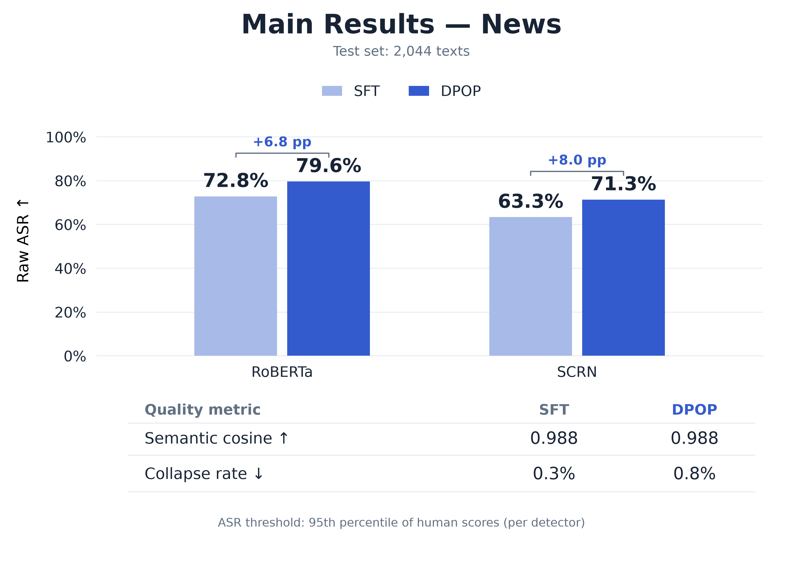
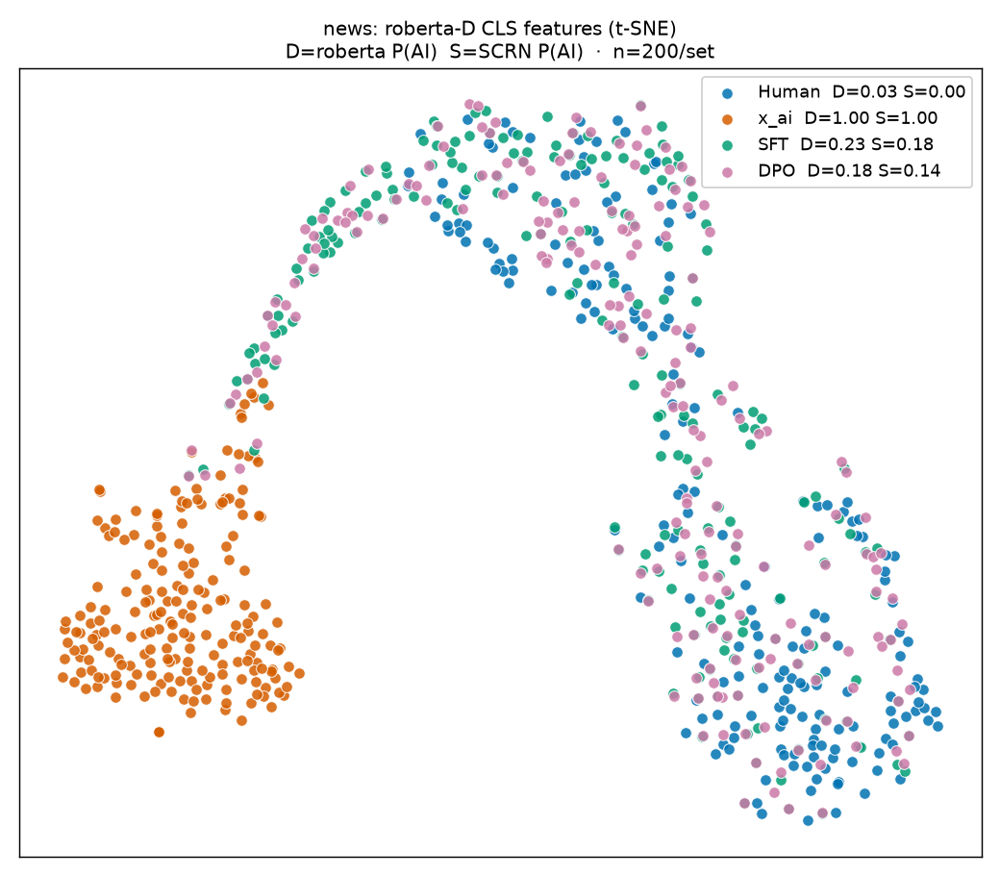
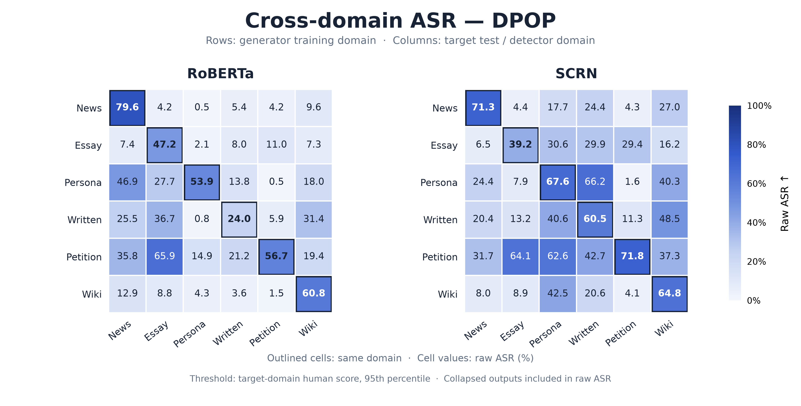
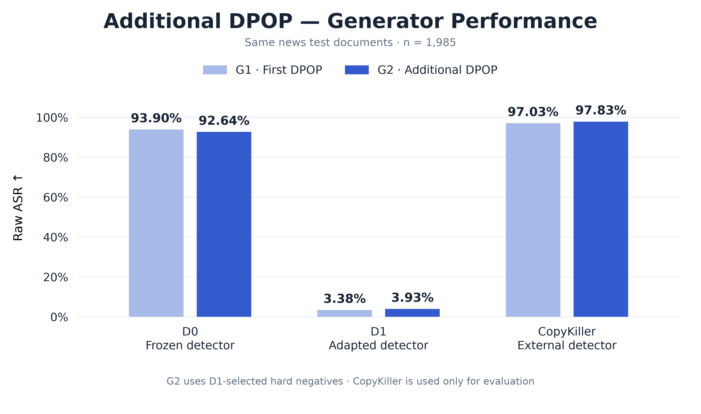
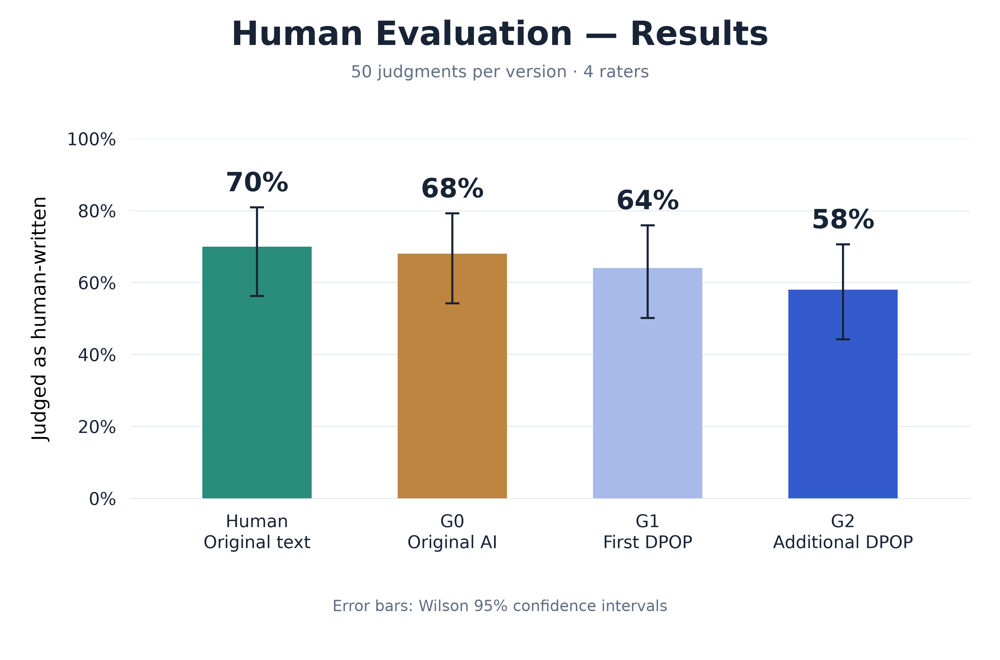

# 너 정말 핵심을 찔렀어 — Korean Text Humanization

📢 2026년 여름학기 [AIKU](https://github.com/AIKU-Official) 활동으로 진행한 프로젝트입니다.

🏆 2026년 여름 AIKU 프로젝트 **2등 수상**

## 소개

AI가 작성한 한국어 글을 받아 **내용을 유지하면서 사람이 쓴 글처럼 다시 쓰는 generator**를 개발하는 프로젝트입니다.
[MASH](https://arxiv.org/abs/2601.08564)를 바탕으로 한국어 데이터와 KoBART를 사용하고, Style-injection SFT 이후 DPOP로 detector 회피를 학습했습니다.

사람다운 문체를 측정하기 위한 proxy로 별도 학습한 detector의 판정을 사용했습니다.
뉴스를 중심으로 방법을 구축한 뒤 6개 도메인 전이, prompting baseline, 강화된 detector를 활용한 추가 학습, 블라인드 사람 평가로 효과와 한계를 확인했습니다.

뉴스 test 2,044편에서 DPOP generator는 **RoBERTa ASR 79.6%, SCRN ASR 71.3%, 의미 cosine 0.988**을 기록했습니다.

## 방법론

| 단계 | 핵심 내용 |
|---|---|
| **1. Inverse Data Construction** | 인간 원문을 Qwen3-8B·EXAONE-3.5-7.8B로 재작성해 Human–AI pair 구축 |
| **2. Detector 학습 및 검증** | KLUE-RoBERTa를 이진 분류기로 학습·검증하고, 인간 원문과 AI 글을 올바르게 구분하는 pair 선별 |
| **3. Style-injection SFT** | KoBART에 AI/Human style vector와 공유 fusion layer를 추가해 입력 복원과 인간 문체 변환을 함께 학습 |
| **4. DPOP alignment** | 인간 원문을 chosen, detector에 탐지된 SFT 출력을 rejected로 삼아 추가 학습 |
| **5. Evaluation** | ASR·의미 유사도·붕괴율, prompting baseline, t-SNE, 6×6 도메인 전이 평가 |
| **6. Adversarial alignment** | G1 출력에 적응한 D1을 학습하고, D1이 탐지한 후보로 G2를 추가 학습 |

```text
인간 원문 ── LLM 재작성 ── Human–AI pair
                              │
                    detector 검증·pair 선별
                              │
                       Style-injection SFT
                              │
                      hard negative → DPOP
                              │
                         generator G1
                         ├── 평가·도메인 전이
                         └── D1 학습 → 추가 DPOP → G2
                                                  │
                                 G1/G2 비교·사람 평가
```

- **Generator:** [gogamza/kobart-base-v2](https://huggingface.co/gogamza/kobart-base-v2) 기반 약 0.1B 모델.
- **학습에 활용한 detector:** [klue/roberta-base](https://huggingface.co/klue/roberta-base). Generator 학습에는 내부 파라미터·gradient 대신 후보의 detector 점수를 사용합니다.
- **별도 평가 detector:** KoELECTRA 기반 SCRN 구현. Generator의 preference 구성에는 사용하지 않습니다.
- **MASH와의 주요 차이:** 한국어 데이터·모델 적용, 길이 정규화 DPOP 사용, 별도 adversarial alignment 및 사람 평가. 논문의 inference-time refinement(Stage 4)는 적용하지 않았습니다.

모델 구조와 loss는 [방법론](docs/methodology.md), 데이터 출처와 분할은 [데이터 구성](docs/data.md)에 설명했습니다.

## 실험 결과

### 평가 질문과 조건

| 질문 | 실험 |
|---|---|
| RQ1. 내용을 보존하면서 detector를 회피할 수 있는가? | 뉴스 test, prompting baseline, t-SNE |
| RQ2. 다른 도메인에도 회피 성능이 전이되는가? | 6개 source × 6개 target의 SFT/DPOP 평가 |
| RQ3. 강화된 detector를 활용한 추가 학습이 성능을 높이는가? | 뉴스 G1→D1→G2 추가 학습 |
| RQ4. 회피 학습이 사람 글로 판단되는 비율도 높이는가? | 4명이 50개 기사의 Human/G0/G1/G2를 블라인드 판별 |

**ASR(Attack Success Rate)**은 전체 generator 출력 중 detector가 인간 글로 판정한 비율입니다.
주 실험에서는 각 detector의 인간 원문 점수 95백분위를 임계값으로 사용합니다.
반복 붕괴 출력도 raw ASR의 분모·분자에 포함될 수 있으므로 붕괴율을 별도로 보고합니다.
의미 cosine은 입력 AI 글과 출력의 임베딩 유사도이며, 임베딩 입력은 최대 256 token입니다.

### 1. 뉴스 주 실험

원천 뉴스 24,500편에서 detector 학습 문서를 제외하고 pair 선별·중복 제거를 거쳐 **20,343쌍**을 구성했습니다.
Generator split은 train **16,266**, dev **2,033**, test **2,044**입니다.

| 모델 | RoBERTa ASR ↑ | SCRN ASR ↑ | 의미 cosine ↑ | 붕괴율 ↓ |
|---|---:|---:|---:|---:|
| SFT | 72.8% | 63.3% | 0.988 | 0.3% |
| **SFT + DPOP** | **79.6%** | **71.3%** | **0.988** | 0.8% |

DPOP 이후 두 detector에 대한 ASR이 높아졌고 의미 cosine은 유지됐습니다. 붕괴율은 0.5%p 증가했습니다.



[집계 수치·조건](results/metrics/news_main_results.json)

뉴스 test 중 200개 기사 ID의 Human·AI·SFT·DPOP 텍스트에서 RoBERTa CLS 표현을 추출해 t-SNE로 시각화했습니다.
SFT·DPOP 출력이 인간 원문과 겹치는 영역을 보였지만, 이는 detector의 표현 공간에 대한 보조 결과입니다.



### 2. Prompting baseline

[DaleSeo/korean-skills](https://github.com/DaleSeo/korean-skills)의 humanizer v1.6.0을 배치 재작성 프롬프트로 변환해 사용했습니다.
원본 AI 글의 생성 모델 계열에 맞춰 Qwen3-8B 또는 EXAONE-3.5-7.8B로 다시 작성했습니다.
세 방법에 **동일한 뉴스 100편**을 입력해 비교했습니다.

| 방법 | RoBERTa ASR ↑ | SCRN ASR ↑ | 의미 cosine ↑ | 붕괴율 ↓ |
|---|---:|---:|---:|---:|
| Prompting baseline | 0.0% | 0.0% | 0.996 | 0.0% |
| SFT | 73.0% | 63.0% | 0.989 | 0.0% |
| SFT + DPOP | 78.0% | 66.0% | 0.989 | 1.0% |

사용한 prompting baseline은 높은 의미 유사도를 유지했지만 detector 회피 효과는 나타나지 않았습니다.

[Baseline 명세·출처](baselines/README.md) · [6개 도메인 보고서](results/reports/humanizer_skill_baseline_n100_20260909.html)

### 3. Cross-domain evaluation

News, Essay, Persona, Written, Petition, Wiki에서 각각 학습한 SFT·DPOP generator를 각 target의 test 전체에 적용했습니다.
Petition·Wiki는 `petition512B`·`wiki512B` 트랙을 사용했습니다.

| Detector | 모델 | 같은 도메인 평균 ASR | 다른 도메인 평균 ASR |
|---|---|---:|---:|
| RoBERTa | SFT | 45.9% | 12.2% |
| RoBERTa | DPOP | 53.7% | 15.2% |
| SCRN | SFT | 54.9% | 22.0% |
| SCRN | DPOP | 62.5% | 26.2% |

평균은 같은 도메인 6조합, 다른 도메인 30조합에 각각 동일 가중치를 부여한 값입니다.
DPOP의 평균 ASR은 향상됐으나 다른 도메인으로 전이할 때 성능이 크게 낮아졌습니다.
일부 조합에는 반복 붕괴도 많아 raw ASR만으로 성공적인 변환이라 판단하기 어렵습니다.



[36조합 전량 보고서](results/reports/cross_domain_current6_full_20260909.html) · [집계 JSON](results/metrics/cross_domain_results.json)

### 4. Adversarial alignment

기존 G1의 출력을 학습해 D1을 만든 뒤, D1에 탐지된 후보를 이용해 G2를 추가 학습했습니다.
**별도 뉴스 test 1,985편**을 사용했으며, 데이터 버전과 decoding 조건이 주 실험과 다릅니다.

| Detector | G1 ASR | G2 ASR |
|---|---:|---:|
| D0 — 기존 detector | 93.90% | 92.64% |
| D1 — G1 출력에 적응한 detector | 3.38% | 3.93% |
| CopyKiller — 외부 평가 | 97.03% | 97.83% |

D1은 G1 출력을 훨씬 잘 탐지했습니다. 추가 DPOP의 효과는 D1·CopyKiller에서 소폭 개선, D0에서는 감소로 나타났습니다.
CopyKiller는 AI 작성률 50%를 기준으로 판정했으며 generator 학습에는 사용하지 않았습니다.



[추가 학습 방법](docs/adversarial_alignment.md) · [실행 방법](adversarial/README.md) · [상세 결과](adversarial/RESULTS.md)

### 5. 사람 평가

50개 기사마다 Human·원본 AI(G0)·G1·G2의 네 버전을 준비하고, 평가자 4명이 기사별로 서로 다른 버전을 판별했습니다.
총 200건, 버전별 50건의 판단입니다.

| 실제 버전 | 사람이 쓴 글로 판단한 비율 |
|---|---:|
| Human | 70% |
| G0 | 68% |
| G1 | 64% |
| G2 | 58% |

G1·G2의 사람 글 판단율은 원본 AI보다 낮았습니다.
다만 버전별 표본이 50건이고 각 기사·버전을 한 명만 평가했으므로 모델 간 차이를 해석하는 데 한계가 있습니다.
이 설문은 작성 주체에 대한 판단을 측정했으며, 자연스러움과 내용 보존은 별도로 평가할 필요가 있습니다.



[사람 평가 보고서](results/reports/human_eval_results_share_20260907.md)

## Contribution & Limitations

**Contribution**

- 한국어 Human–AI pair 구축부터 Style-SFT·DPOP·평가까지 연결한 실험 파이프라인을 구현했습니다.
- 약 0.1B의 소형 generator로 높은 detector 회피율과 입력 대비 의미 유사도를 확인했습니다.
- Detector의 출력 점수로 preference를 구성해, generator 최적화에 detector 내부 구조·파라미터·gradient가 필요하지 않은 학습 방식을 적용했습니다.

**Limitations**

- 다른 도메인으로의 전이와 강화된 detector를 활용한 추가 학습의 효과가 제한적이었습니다.
- 일부 조건에서 반복 붕괴가 증가했습니다. 높은 ASR·cosine만으로 자연스러움과 사실 보존을 보장할 수 없습니다.
- MASH의 inference-time refinement는 적용하지 못했습니다. LLM에 따라 자연스러움 평가가 달라 후처리의 품질 개선 효과를 판단할 일관된 기준을 마련하는 데 어려움이 있었습니다.
- 사람 평가에서 인간다움의 향상을 확인하지 못했습니다. 더 많은 평가자와 자연스러움·의미 보존의 직접 평가가 필요합니다.

## 환경 설정

Python 3.10 이상을 기준으로 합니다. 모델 학습·추론에는 CUDA GPU와 각 단계의 데이터·checkpoint가 필요합니다.
GPU에 맞는 PyTorch를 준비한 뒤 나머지 의존성을 설치합니다.

```bash
python3 -m venv .venv
source .venv/bin/activate
pip install -r requirements.txt
```

AI pair 생성은 Qwen·EXAONE의 OpenAI-compatible API endpoint를 사용합니다.
API 주소와 데이터·모델 경로는 설정 파일에 지정합니다.
주 파이프라인과 adversarial 실험은 Transformers 버전이 달라 **별도 가상환경**을 사용합니다.
Adversarial 실험의 환경 설정과 실행 명령은 [별도 실행 안내](adversarial/README.md)에 있습니다.

## 사용 방법

### 저장소 구조

```text
pipeline/              전체 파이프라인 실행·설정·평가
scripts/               원천 데이터 처리·SFT·DPOP·detector·baseline
  figures/             집계 결과를 그래프로 변환
baselines/             prompting baseline 설정·프롬프트·라이선스
adversarial/           G1 → D1 → G2 추가 학습·평가
docs/                  방법론·데이터·재현 안내
results/
  reports/             최종 집계 보고서
  metrics/             그래프 입력·출처·평가 조건
  figures/             결과 그래프
```

학습·평가에 필요한 데이터와 모델 가중치는 별도로 준비해야 합니다. [데이터 준비](docs/data.md)

### 파이프라인 실행

설정 파일에 데이터·모델 경로와 Qwen·EXAONE 서버 주소를 지정합니다.

```bash
cp pipeline/configs/news.example.json pipeline/configs/news.local.json

python pipeline/run.py --config pipeline/configs/news.local.json --gpu 0
```

데이터 병합, 단계별 학습, checkpoint 평가 명령은 [실행 안내](docs/reproduction.md)에 있습니다.

### 결과 그래프

`results/metrics/`의 집계 수치와 보고서로 그래프를 생성합니다.

```bash
python scripts/figures/build_main_results.py
python scripts/figures/build_cross_domain.py
python scripts/figures/build_human_evaluation.py
```

전체 결과와 그래프 생성 명령은 [결과 자료](results/README.md)에 있습니다.

## 참고자료

- [MASH: Evading Black-Box AI-Generated Text Detectors via Style Humanization](https://arxiv.org/abs/2601.08564)
- [KoBART](https://huggingface.co/gogamza/kobart-base-v2), [KLUE-RoBERTa](https://huggingface.co/klue/roberta-base), [KoELECTRA](https://huggingface.co/monologg/koelectra-base-v3-discriminator)
- [DaleSeo/korean-skills](https://github.com/DaleSeo/korean-skills) — baseline의 원본 프롬프트. [MIT 라이선스 고지](baselines/LICENSE.humanizer)를 포함합니다.
- 데이터 출처와 사용한 트랙: [docs/data.md](docs/data.md)
